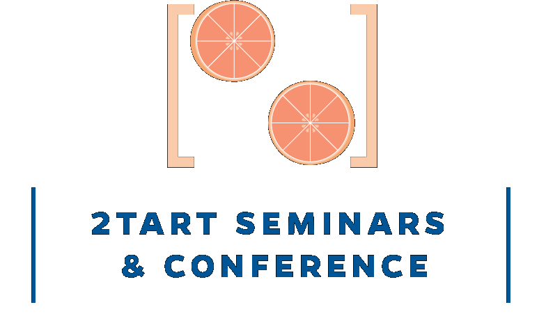

  
  <article>
    <h2>
      <a href="/optin/{{ post.url }}">
        {{ post.title }}
      </a>
    </h2>
    <time datetime="{{ post.date | date: "%Y-%m-%d" }}">{{ post.date | date_to_long_string }}</time>
    {{ post.content }}
  </article>
